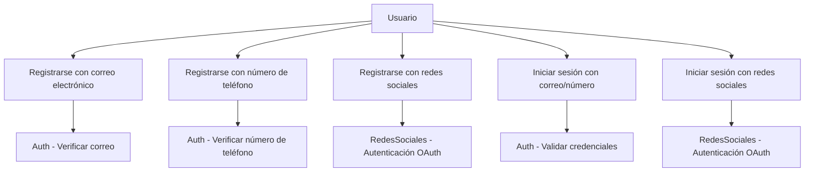
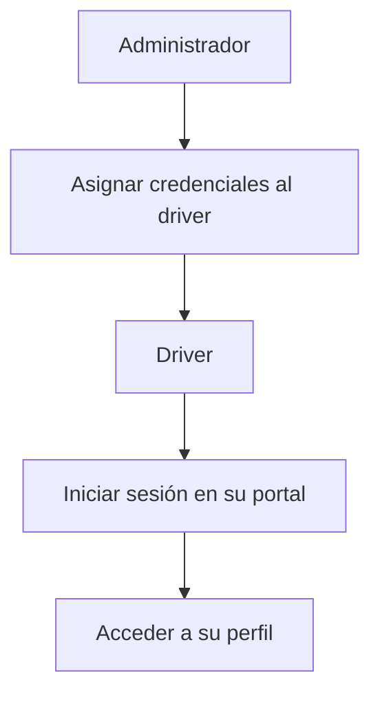
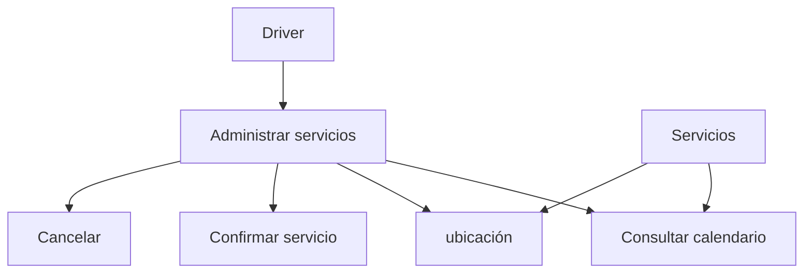
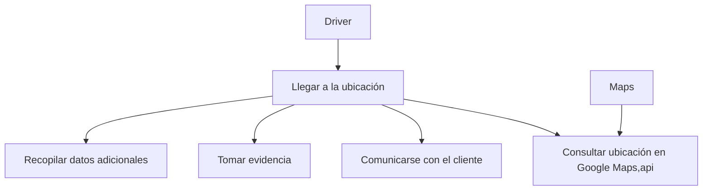
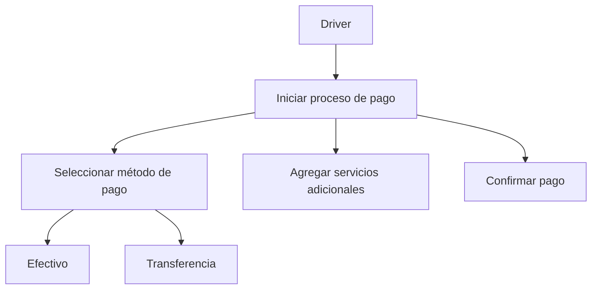
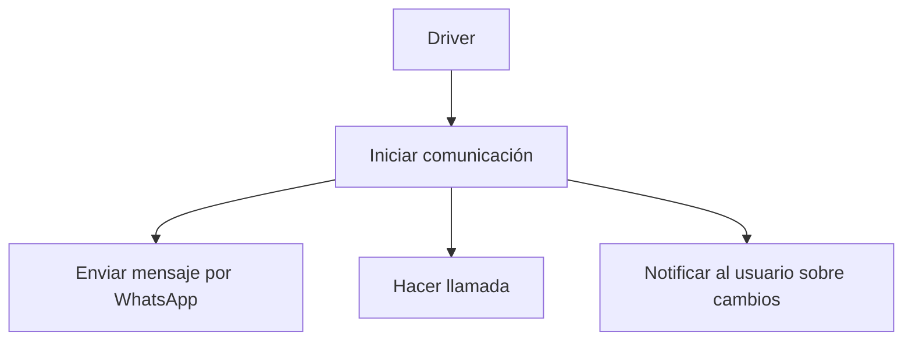
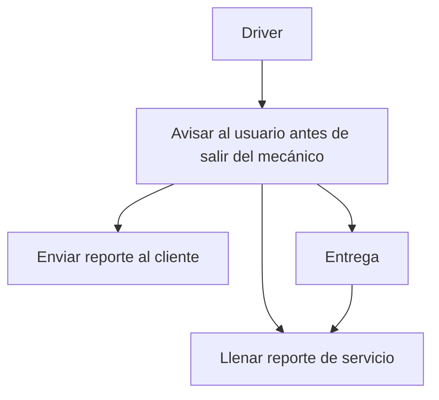

# 1.Registro e Inicio de Sesión

### Definir actores y casos de uso
Usuario: Interactúa con el sistema para registrarse o iniciar sesión.

Sistema de Autenticación (Auth): Responsable de validar el correo o el número de teléfono.

Redes Sociales: Servicios externos (Google, Facebook, etc.)

### Definir el diagrama de casos de uso


# 2. Credenciales

### Definir actores y casos de uso
actor Administrador
actor Driver
actor "Sistema de Autenticación" as Autenticación

### Diagrama de casos de uso


# 3. Servicios Agendados

### Definir actores y casos de uso
El driver recolectara dependiendo la fecha

### Diagrama de casos de uso



# 4. Recolección

### Definir actores y casos de uso
llegada a la ubicación, la consulta de la ubicación mediante Google Maps API, la comunicación con el cliente, la toma de evidencia y la recopilación de datos adicionales.

### Diagrama de casos de uso


# 5. Pago

### Definir actores y casos de uso
actor Driver
actor "Sistema de Pago" as Pago

### Diagrama de casos de uso


# 6. Comunicación

### Definir actores y casos de uso
El inicio de la comunicación, el envío de mensajes por WhatsApp, la realización de llamadas y la notificación al usuario sobre cambios en el servicio.


### Diagrama de casos de uso


# 7. Entrega

### Definir actores y casos de uso
ncluyen el aviso al usuario antes de salir del mecánico, el llenado del reporte de servicio y el envío del reporte al cliente.

### Diagrama de casos de uso


# 8. Perfil del Driver

### Definir actores y casos de uso
actor Driver
actor "Sistema de Perfil" 

### Diagrama de casos de uso

```mermaid
graph TD
    Driver --> A[Acceder al perfil]
    A --> B[Consultar ganancias]
    A --> C[Consultar servicios realizados]
    A --> D[Consultar recolecciones]
    A --> E[Modificar información personal]

    Perfil --> B
    Perfil --> C
    Perfil --> D
    Perfil --> E

