# Casos de uso para portal administrativo

---

# Caso de uso: Seguimiento a órdenes de servicio

### Actores:
- **Usuario**: Persona que accede al sistema para ver las órdenes y sus datos.
- **Mecánico**: Trabajador del taller que actualiza el estado de las órdenes.
- **Sistema de Órdenes**: Plataforma que gestiona el estado y datos de las órdenes.

### Descripción:
El sistema permite a los usuarios ver la información de sus órdenes de servicio y los datos personales asociados. Los mecánicos en el taller pueden acceder al sistema para actualizar el estado de las órdenes en tiempo real, incluyendo la posibilidad de subir imágenes y videos que reflejen el progreso de las reparaciones o servicios.

### Precondiciones:
- El usuario debe haber iniciado sesión.
- El mecánico debe tener acceso al sistema desde el taller.
  
### Flujo principal:
1. El **Usuario** puede ver la información de sus órdenes, incluyendo detalles y estado actual.
2. El **Usuario** también puede acceder a los datos personales relacionados con las órdenes.
3. El **Mecánico** desde el taller accede al sistema para visualizar las órdenes asignadas.
4. El **Mecánico** puede actualizar el estado de la orden en tiempo real y subir imágenes o videos del servicio.

### Diagrama de casos de uso

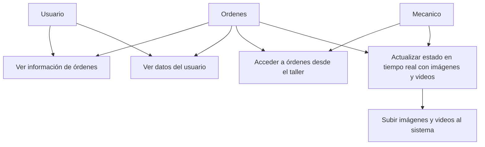

### Excepciones:
- Error de conexión al sistema al intentar actualizar el estado.
- El usuario no tiene órdenes pendientes de revisión.

---

# Caso de uso: Formulario de reporte de servicios con fotos

### Actores:
- **Mecánico**: Trabajador del taller que reporta el estado del servicio.
- **Sistema de Reportes**: Plataforma que gestiona los formularios de servicio.
- **Área de Servicios**: Otra área del taller que necesita acceder a los reportes generados.

### Descripción:
El sistema permite a los mecánicos acceder a un formulario para reportar el estado de los servicios realizados. El formulario incluye la opción de adjuntar fotos del trabajo completado. El área de servicios puede acceder a estos reportes para seguimiento.

### Precondiciones:
- El mecánico debe haber iniciado sesión y tener acceso a las órdenes asignadas.
  
### Flujo principal:
1. El **Mecánico** accede al formulario de reporte de servicios.
2. El **Mecánico** llena los detalles del servicio realizado.
3. El **Mecánico** adjunta fotos como evidencia del servicio.
4. El **Área de Servicios** tiene acceso a estos reportes para su revisión.

### Diagrama de casos de uso

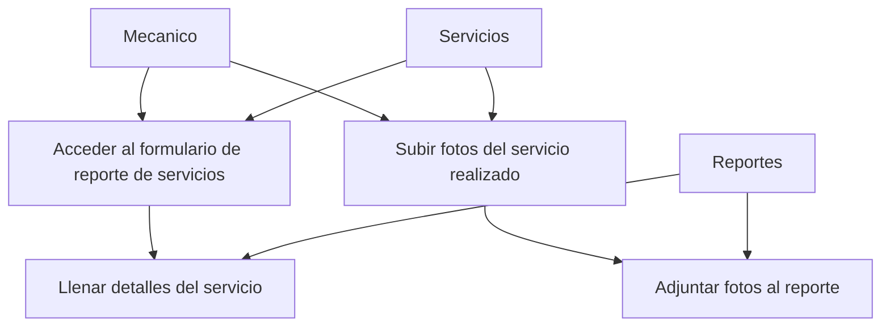
---

# Caso de uso: Analíticos

### Actores:
- **Usuario**: Persona que accede al sistema para visualizar los datos analíticos.
- **Sistema de Analíticos**: Plataforma que gestiona los datos agregados, gráficas y análisis.

### Descripción:
El sistema permite a los usuarios ver datos agregados relacionados con el desempeño del servicio, visualizar gráficas y obtener análisis detallados de las operaciones.

### Precondiciones:
- El usuario debe haber iniciado sesión.
  
### Flujo principal:
1. El **Usuario** accede a la sección de analíticos.
2. El **Usuario** visualiza datos agregados de las operaciones.
3. El **Usuario** puede ver gráficas generadas con los datos.
4. El **Usuario** consulta análisis detallados.

### Diagrama de casos de uso

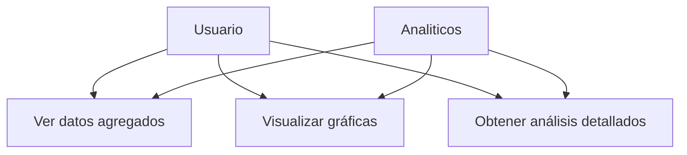

---

# Caso de uso: Registro de refacciones

### Actores:
- **Usuario**: Persona encargada de gestionar el inventario de refacciones.
- **Sistema de Refacciones**: Plataforma que permite la gestión de refacciones.

### Descripción:
El sistema permite al usuario realizar operaciones CRUD (Crear, Leer, Actualizar, Eliminar) sobre el inventario de refacciones.

### Precondiciones:
- El usuario debe tener permisos para gestionar refacciones.
  
### Flujo principal:
1. El **Usuario** accede a la sección de refacciones.
2. El **Usuario** puede crear nuevas refacciones.
3. El **Usuario** puede leer el inventario actual.
4. El **Usuario** puede actualizar información de refacciones.
5. El **Usuario** puede eliminar refacciones obsoletas.

### Diagrama de casos de uso

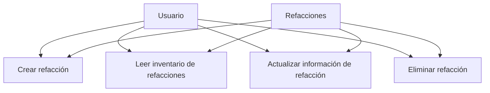

---

# Caso de uso: Registro de autos

### Actores:
- **Usuario**: Persona encargada de gestionar el inventario de autos.
- **Sistema de Autos**: Plataforma que permite la gestión de autos.

### Descripción:
El sistema permite al usuario realizar operaciones CRUD sobre el inventario de autos.

### Precondiciones:
- El usuario debe tener permisos para gestionar autos.
  
### Flujo principal:
1. El **Usuario** accede a la sección de autos.
2. El **Usuario** puede crear nuevos autos.
3. El **Usuario** puede leer el inventario actual de autos.
4. El **Usuario** puede actualizar información de autos.
5. El **Usuario** puede eliminar autos obsoletos.

### Diagrama de casos de uso

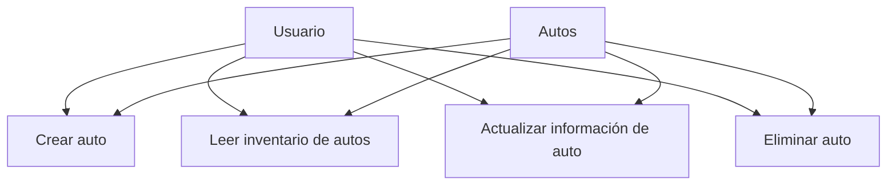

---

# Caso de uso: Registro de servicios

### Actores:
- **Usuario**: Persona encargada de gestionar el catálogo de servicios.
- **Sistema de Servicios**: Plataforma que permite la gestión de servicios.

### Descripción:
El sistema permite al usuario realizar operaciones CRUD sobre el catálogo de servicios.

### Precondiciones:
- El usuario debe tener permisos para gestionar servicios.
  
### Flujo principal:
1. El **Usuario** accede a la sección de servicios.
2. El **Usuario** puede crear nuevos servicios.
3. El **Usuario** puede leer el catálogo actual de servicios.
4. El **Usuario** puede actualizar información de servicios.
5. El **Usuario** puede eliminar servicios obsoletos.

### Diagrama de casos de uso

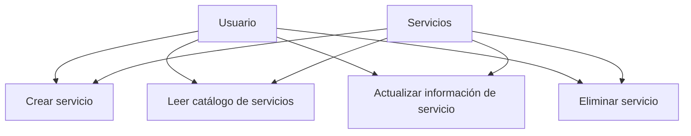

---

# Caso de uso: Registro de talleres

### Actores:
- **Usuario**: Persona encargada de gestionar los talleres.
- **Sistema de Talleres**: Plataforma que permite la gestión de talleres.

### Descripción:
El sistema permite al usuario realizar operaciones CRUD sobre los talleres.

### Precondiciones:
- El usuario debe tener permisos para gestionar talleres.
  
### Flujo principal:
1. El **Usuario** accede a la sección de talleres.
2. El **Usuario** puede crear nuevos talleres.
3. El **Usuario** puede leer el inventario actual de talleres.
4. El **Usuario** puede actualizar información de talleres.
5. El **Usuario** puede eliminar talleres obsoletos.

### Diagrama de casos de uso

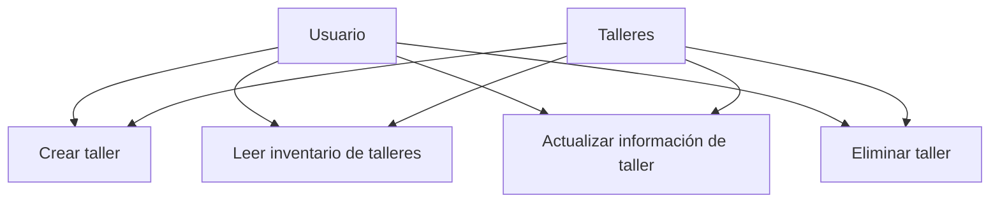

---

# Caso de uso: Asignación de drivers

### Actores:
- **Usuario**: Persona que gestiona la asignación de drivers.
- **Sistema de Drivers**: Plataforma que gestiona los conductores disponibles.

### Descripción:
Cuando un nuevo servicio es registrado, el sistema asigna automáticamente un driver disponible que coincida con el horario y la zona del servicio.

### Precondiciones:
- El servicio debe estar registrado.
- Deben existir drivers disponibles en la zona y horario del servicio.

### Flujo principal:
1. El **Usuario** registra un nuevo servicio.
2. El **Sistema de Drivers** busca un driver disponible en la zona y horario del servicio.
3. El **Sistema de Drivers** asigna el servicio al driver correspondiente.

### Diagrama de casos de uso

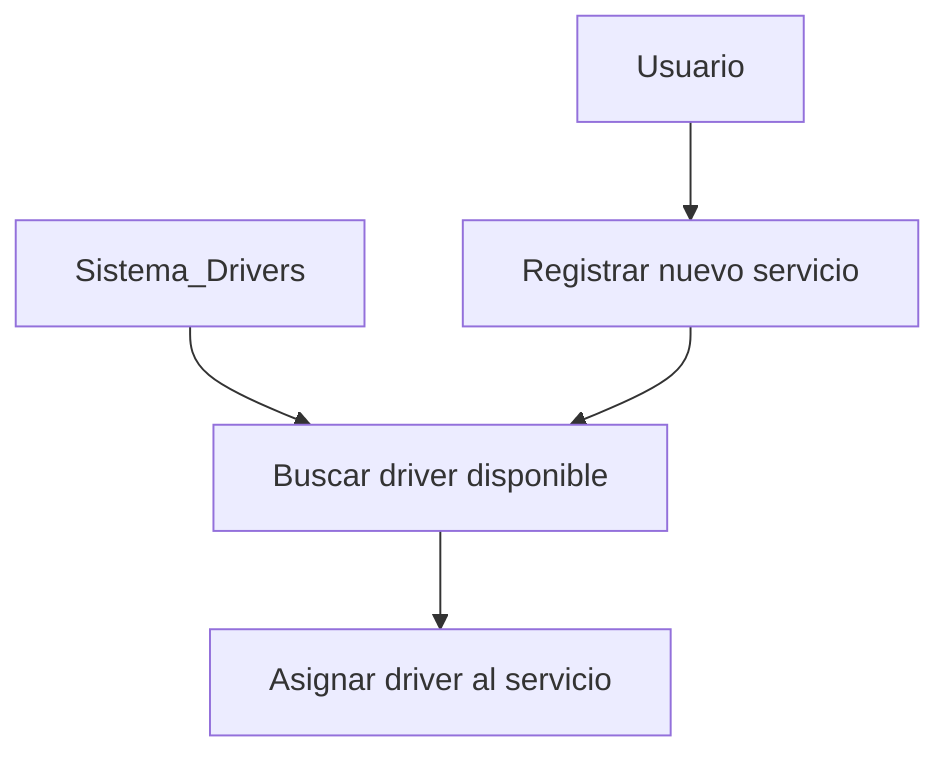

---

# Caso de uso: Asignación de Punto Car-e

### Actores:
- **Usuario**: Persona que gestiona la asignación a Puntos Car-e.
- **Sistema de Puntos Car-e**: Plataforma que gestiona los Puntos Car-e.

### Descripción:
Cuando un nuevo servicio es registrado, el sistema asigna automáticamente el Punto Car-e más cercano para la prestación del servicio.

### Precondiciones:
- El servicio debe estar registrado.
- Debe existir un Punto Car-e cercano disponible.

### Flujo principal:
1. El **Usuario** registra un nuevo servicio.
2. El **Sistema de Puntos Car-e** busca el punto más cercano disponible.
3. El **Sistema de Puntos Car-e** asigna el servicio al Punto Car-e correspondiente.

### Diagrama de casos de uso

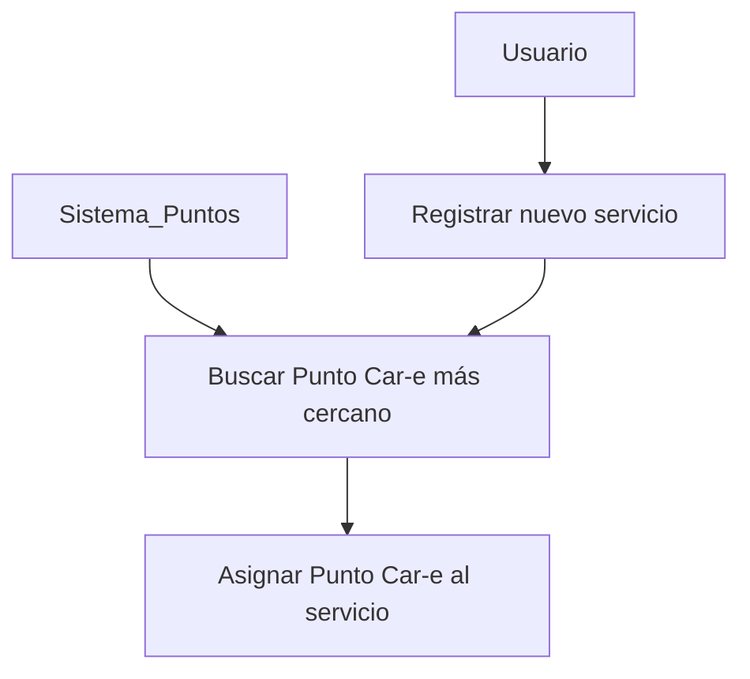

---

# Caso de uso: Próximos servicios

### Actores:
- **Usuario**: Persona que visualiza los próximos servicios.
- **Sistema de Servicios**: Plataforma que sugiere y gestiona los próximos servicios.

### Descripción:
El sistema sugiere próximos servicios al usuario basándose en la fecha y la cotización de los servicios disponibles.

### Precondiciones:
- El usuario debe haber solicitado servicios previamente.

### Flujo principal:
1. El **Usuario** accede a la sección de próximos servicios.
2. El **Sistema de Servicios** sugiere servicios basados en fecha y cotización.
3. El **Usuario** puede revisar la información detallada de cada servicio sugerido.

### Diagrama de casos de uso

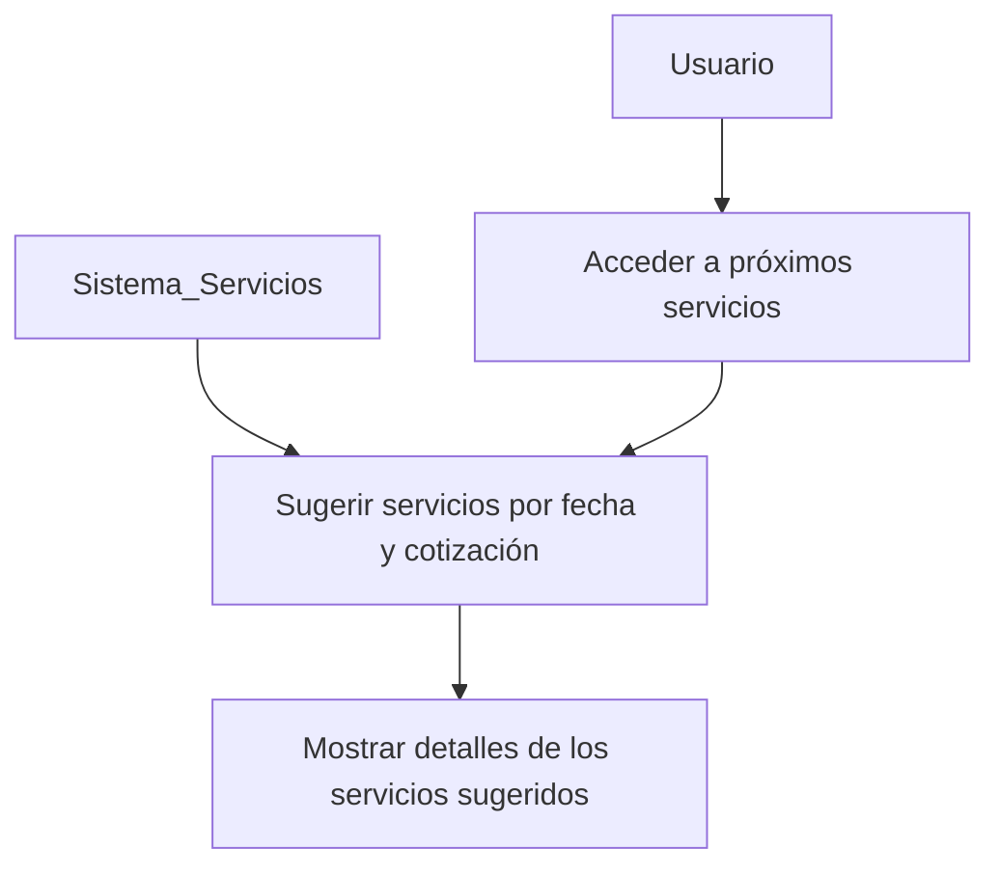

---

# Caso de uso: Resumen de servicios

### Actores:
- **Usuario**: Persona que consulta el resumen de servicios.
- **Sistema de Servicios**: Plataforma que gestiona el estado de los servicios activos.

### Descripción:
El sistema proporciona un resumen de los servicios que están activos en el momento, permitiendo al usuario consultarlos.

### Precondiciones:
- Deben existir servicios activos.

### Flujo principal:
1. El **Usuario** accede a la sección de resumen de servicios.
2. El **Sistema de Servicios** muestra los servicios que están activos en ese momento.
3. El **Usuario** puede consultar detalles de cada servicio activo.

### Diagrama de casos de uso

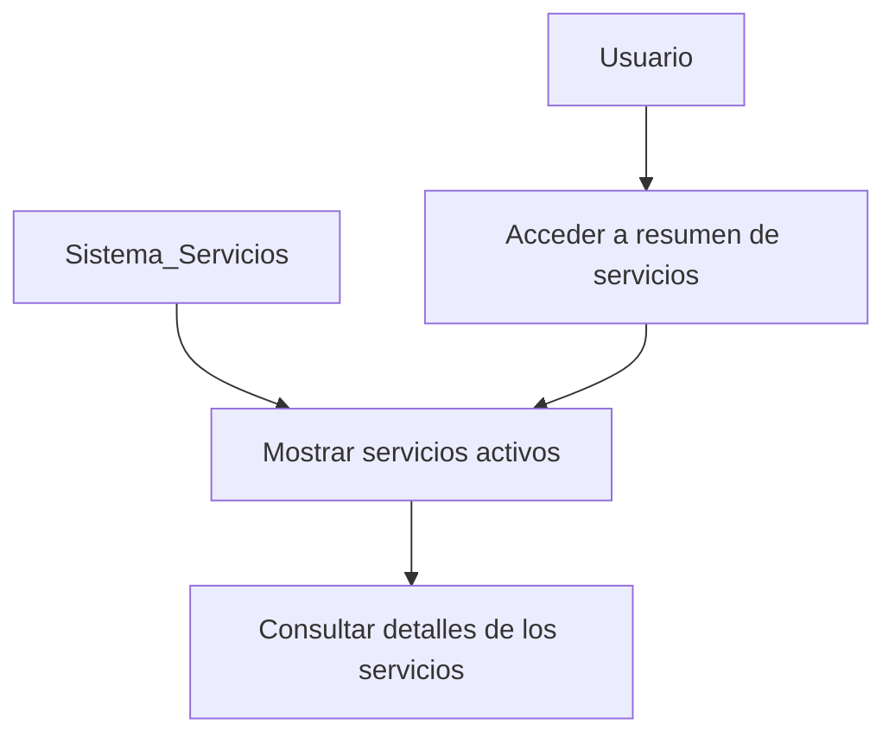

