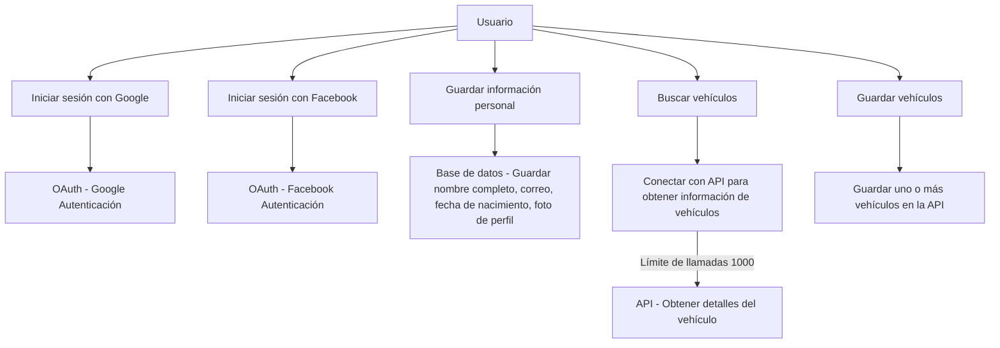
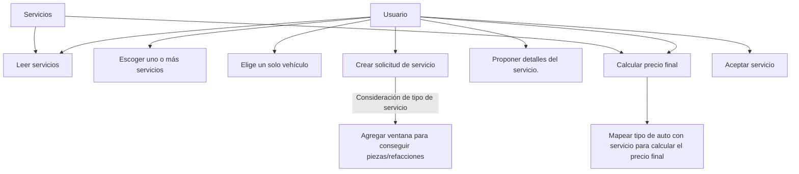
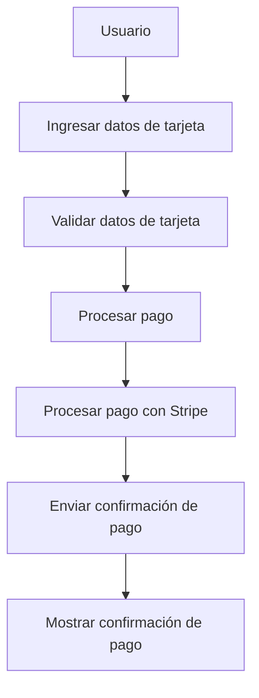
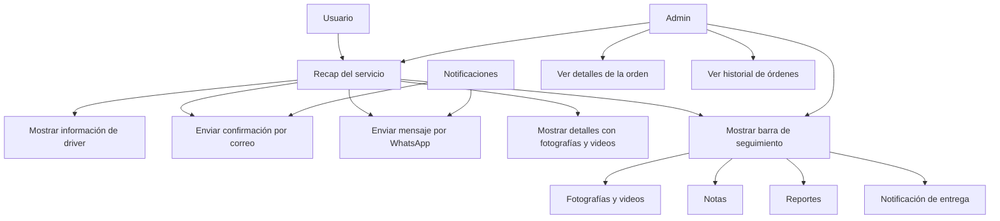
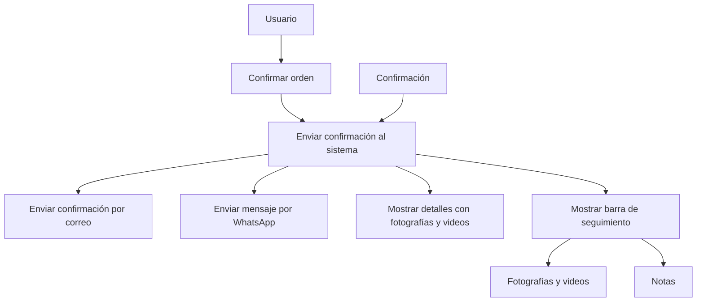
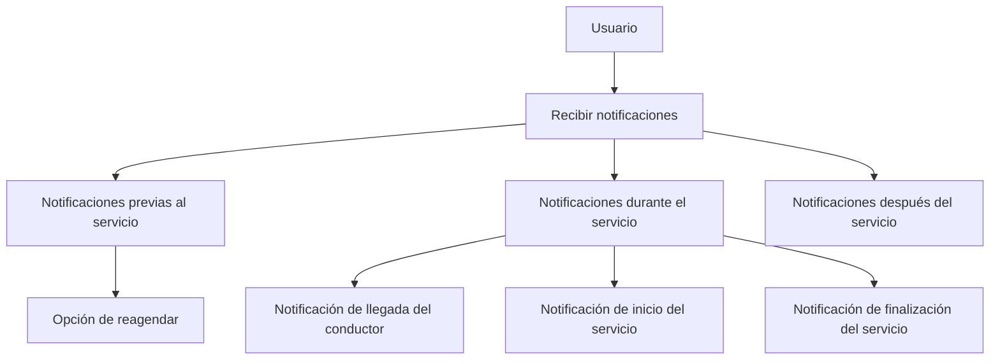
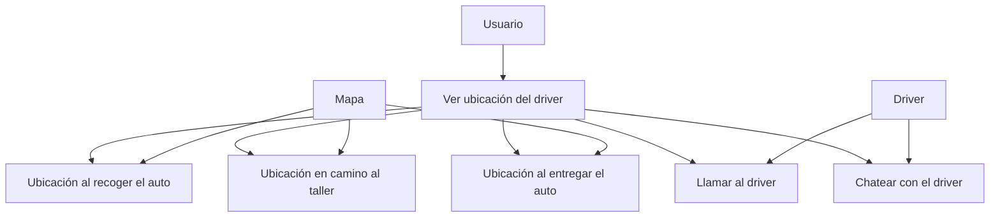
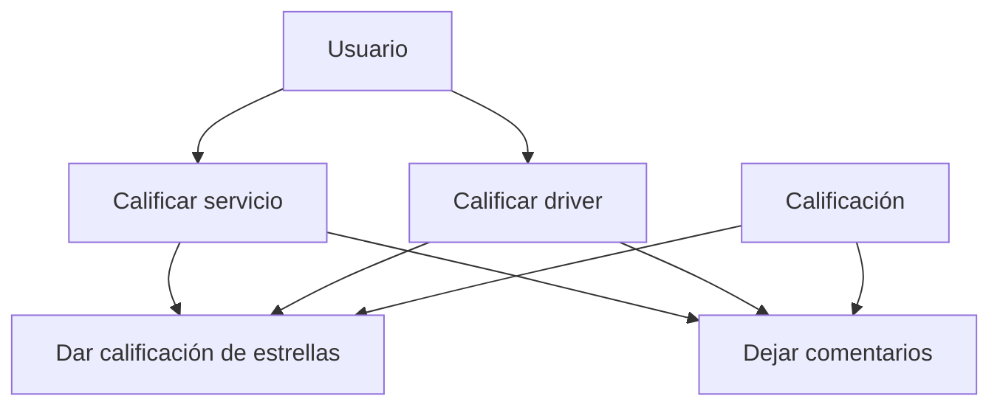
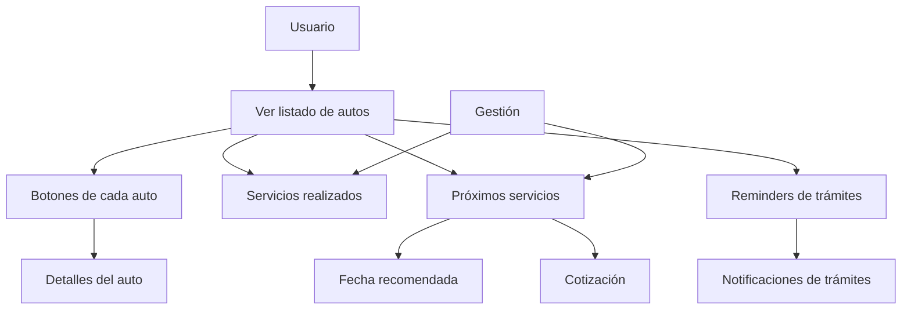

# Usuario guarda su información

### Definir actores y casos de uso
actor Usuario
actor "Google/Facebook" as OAuth
actor "API Vehículos" as API

### Definir el diagrama de casos de uso

### Explicación:
- Los actores involucrados son **Usuario**, **OAuth (Google/Facebook)** y **API Vehículos**.
- Los casos de uso incluyen la autenticación con Google o Facebook, el almacenamiento de información personal, la búsqueda y el guardado de vehículos.
- El bloque Mermaid es responsable de generar el diagrama de flujo.

---

# Listado/agendado de servicio

### Definir actores y casos de uso
actor Usuario
actor "Sistema de Servicios" as Servicios

### Definir el diagrama de casos de uso

### Explicación:
- Diagrama con los actores **Usuario** y **Sistema de Servicios**.
- Los casos de uso cubren la selección de servicios, la creación de una solicitud, la propuesta de detalles, el cálculo del precio final y la aceptación del servicio.

---

# Portal de pago

### Definir actores y casos de uso
actor Usuario
actor "Sistema de Pago" as Stripe

### Definir el diagrama de casos de uso

### Explicación:
- Los actores involucrados son **Usuario** y **Sistema de Pago (Stripe)**.
- Los casos de uso incluyen la entrada de datos de la tarjeta, la validación de los datos, el procesamiento del pago y la confirmación del pago.

---

# Listado de solicitudes y órdenes

### Definir actores y casos de uso
actor Usuario
actor "Sistema de Notificaciones" as Notificaciones
actor "Perfil Administrativo" as Admin

### Definir el diagrama de casos de uso

### Explicación:
- Los actores involucrados son **Usuario**, **Sistema de Notificaciones** y **Perfil Administrativo**.
- Los casos de uso incluyen la visualización de información del conductor, la confirmación por correo, el envío de mensajes por WhatsApp, la visualización de detalles con fotos y videos, la barra de seguimiento y la notificación de entrega.

---

# Confirmación de la cita

### Definir actores y casos de uso
actor Usuario
actor "Sistema de Confirmación" as Confirmación

### Definir el diagrama de casos de uso

### Explicación:
- Los actores involucrados son **Usuario** y **Sistema de Confirmación**.
- Los casos de uso incluyen la confirmación de la orden, el envío de confirmación al sistema, la confirmación por correo, el envío de mensajes por WhatsApp, la visualización de detalles con fotos y videos, la barra de seguimiento y las notas.

---

# Notificaciones

### Definir actores y casos de uso
actor Usuario
actor "Sistema de Notificaciones" as Notificaciones

### Definir el diagrama de casos de uso

### Explicación:
- Los actores involucrados son **Usuario** y **Sistema de Notificaciones**.
- Los casos de uso incluyen la recepción de notificaciones, las notificaciones previas, durante y después del servicio, y la opción de reagendar.

---

# Mapa

### Definir actores y casos de uso
actor Usuario
actor "Sistema de Mapa" as Mapa
actor "Driver" as Driver

### Definir el diagrama de casos de uso

### Explicación:
- Los actores involucrados son **Usuario**, **Sistema de Mapa** y **Driver**.
- Los casos de uso incluyen la visualización de la ubicación del conductor, la ubicación al recoger el auto, en camino al taller y al entregar el auto, y la posibilidad de llamar o chatear con el conductor.

---

# Perfil

# Diagrama de casos de uso: Calificación a driver y del servicio

### Definir actores y casos de uso
actor Usuario
actor "Sistema de Calificación" as Calificación

### Definir el diagrama de casos de uso

### Explicación:
- Los actores involucrados son **Usuario** y **Sistema de Calificación**.
- Los casos de uso incluyen la calificación del servicio y del conductor, con la posibilidad de dar una calificación de estrellas y dejar comentarios.

---

# Listado/registro de autos

### Definir actores y casos de uso
actor Usuario
actor "Sistema de Gestión de Autos" as Gestión

### Definir el diagrama de casos de uso

### Explicación:
- Los actores involucrados son **Usuario** y **Sistema de Gestión de Autos**.
- Los casos de uso incluyen la visualización de un listado de autos, los botones de cada auto, los servicios realizados, los próximos servicios y los reminders de trámites.

---
